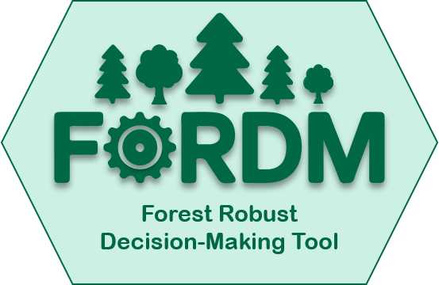

  

# FoRDM
Description...

## Table of contents
1. [Introduction](#introduction)  
2. [Structure](#structure)  
3. [Functions](#functions)  
   - [build_fordm_table](#build_fordm_table)  
   - [build_objectives](#build_objectives)
   - [fordm_analysis_regret](#fordm_analysis_regret)  
   - [fordm_analysis_qperform](#fordm_analysis_qperform)  
   - [visualize_fordm_2d](#visualize_fordm_2d)  
   - [visualize_fordm_3d](#visualize_fordm_3d)  
   - [robustness_frontier_explorer](#robustness_frontier_explorer)  
   - [visualize_rfe](#visualize_rfe)  
4. [Example](#example)  
5. [Citation](#citation)  
6. [Funding](#funding)  
7. [References](#references)

---

## Introduction
...

## Structure
Main implementation is R-package.... That file provides helpers to build input tables and objectives, run robustness analyses (regret and quantile-performance) and visualize results (2D/3D Pareto front) as well as robustness frontier exploration.

## Functions
### Input file
The input file ... forest simulation model output ... values of e.g., ecosystem services...  needs to be ... containing the columns...
Example:...

### ***build_fordm_table()***
Description  
Transfers a provided data.frame into the FoRDM input format. Identifies management, SOW (state-of-world) and time columns; all other columns are treated as objectives.

**Inputs**
- *_data_*: data.frame containing the input data.  
- *_management_*: name (string) of the management column.  
- *_sow_*: name (string) of the SOW (state-of-world) column.  
- *_time_*: name (string) of the time column.

**Output**
- A list with:  
  - *data*: the original data.frame,  
  - *mapping*: list(management, sow, time),  
  - *objectives*: character vector of objective column names.

### ***build_objectives()***
Constructs an objectives data.frame specifying objective names, optimization direction, weights, time-aggregation method and discount rates for each objective.

**Inputs**
- *_obj.names_*: character vector of objective column names.  
- *_obj.dirs_*: character vector of "maximize" / "minimize" (default: all "maximize").  
- *_obj.weights_*: numeric vector of relative weights (must sum to 1).  
- *_obj.timeagg_*: character vector for time aggregation per objective ("mean" or "sum").  
- *_obj.dr_*: numeric vector of discount rates per objective.

**Output**
- A data.frame with columns: *obj.names*, *obj.dirs*, *obj.weights*, *obj.timeagg*, *obj.dr*.

### ***fordm_analysis_regret()***
Performs regret-based (Regret Type 2) multi-objective robustness analysis. Aggregates across time (with discounting), computes global ideals/worsts, calculates per-SOW and per-management regrets, forms weighted scalar regrets and selects robust representative SOWs per management. Produces Pareto front (real and normalized) and identifies the optimal robust management.

**Inputs**
- *_fordm.table_*: output from *build_fordm_table()*.  
- *_objectives_*: output from *build_objectives()*.  
- *_quantile_*: numeric 0-1 robustness threshold (e.g., 0.05).  
- *_sow.selection_*: "representative" (default) or "mean" — how to choose SOW per management.

**Output**
- A list with:  
  - *optimal*: row for the selected optimal management (renamed column "management"),  
  - *pareto.front.real*: data.frame of Pareto front with real objective values,  
  - *pareto.front.normalized*: data.frame of Pareto front with objectives normalized to global ideal/worst.

### ***fordm_analysis_qperform()***
Performs quantile-performance robustness analysis. Aggregates across time (with discounting), computes per-management quantile values for each objective, normalizes them and computes weighted scores to identify optimal management. Returns Pareto front in real (quantiles) and normalized forms.

**Inputs**
- *_fordm.table_*: output from *build_fordm_table()*.  
- *_objectives_*: output from *build_objectives()*.  
- *_quantile_*: single numeric or named vector of quantiles (0-1) per objective.

**Output**
- A list with:  
  - *optimal*: row for the selected optimal management (renamed column "management"),  
  - *pareto.front.real*: data.frame of Pareto front with quantile values (columns named as objectives),  
  - *pareto.front.normalized*: data.frame of Pareto front with normalized quantile values.

### ***visualize_fordm_2d()***
Create a 2D ggplot2 scatter plot of the Pareto front for two selected objectives. Supports plotting real or normalized values.

**Inputs**
- *_analysis.output_*: result from *fordm_analysis_regret()* or *fordm_analysis_qperform()*.  
- *_x_*: objective name for x-axis (string).  
- *_y_*: objective name for y-axis (string).  
- *_values_*: "real" (default) or "normalized".

**Output**
- A ggplot2 object (plot) showing the 2D Pareto front with management labels.

### ***visualize_fordm_3d()***
Create a 3D interactive Pareto front plot using plotly for three selected objectives. Supports plotting real or normalized values.

**Inputs**
- *_analysis.output_*: result from *fordm_analysis_regret()* or *fordm_analysis_qperform()*.  
- *_x_*, *_y_*, *_z_*: objective names for the three axes (strings).  
- *_values_*: "real" (default) or "normalized".

**Output**
- A plotly object (interactive 3D scatter) showing the Pareto front.

### ***robustness_frontier_explorer()***
Explores the robustness frontier across a range of robustness (quantile) levels. Works with both regret-based and quantile-performance methods. Tracks which management is best at each robustness level, computes marginal benefits and losses when management changes, and returns a table of frontier results.

**Inputs**
- *_fordm.table_*: output from *build_fordm_table()*.  
- *_objectives_*: output from *build_objectives()*.  
- *_quantile.range_*: numeric vector length 2 with min and max robustness quantile (e.g., c(0, 0.5)).  
- *_sow.selection_*: "representative" or "mean".  
- *_method_*: "regret" (default) or "qperform".

**Output**
- data.frame with one row per robustness level (for the selected best management), including:  
  - *management*, *robustness.level*,  
  - objective columns (real or quantile-based as appropriate),  
  - marginal benefit and marginal loss columns for each objective (named *<obj>.benefit* and *<obj>.loss*).

### ***visualize_rfe()***
Description  
Visualizes robustness frontier explorer output. Plots objective trajectories across robustness levels, annotates management labels and shows marginal benefits/losses when management changes.

**Inputs**
- *_rfe_output_*: data.frame returned by *robustness_frontier_explorer()*.

**Output**
- A ggplot2 object visualizing the robustness frontier with annotations for benefits (→) and losses (←).

## Example
...

## Citation
Djahangard & Yousefpour 2025

## Funding
This work was funded by the EU HORIZON project "eco2adapt"...  
We also thank the EU ... project "DecisionES" for support...

## References
...
...existing code...
