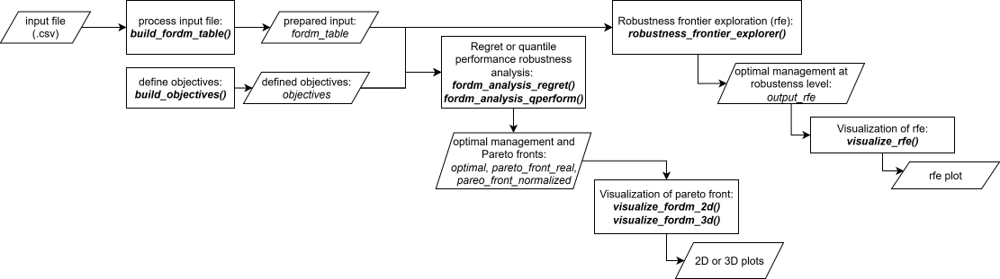
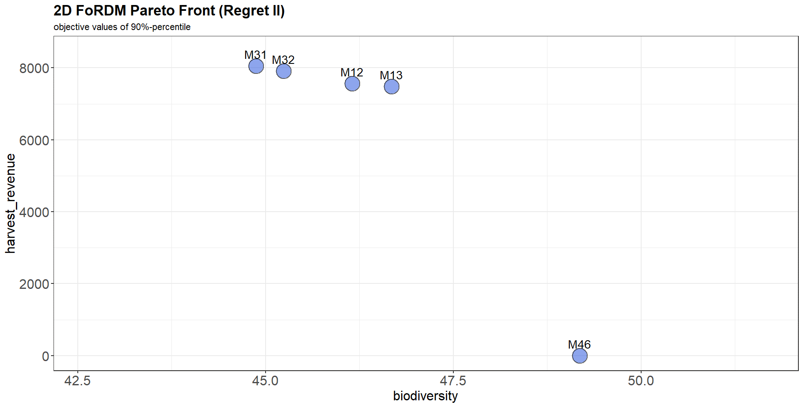
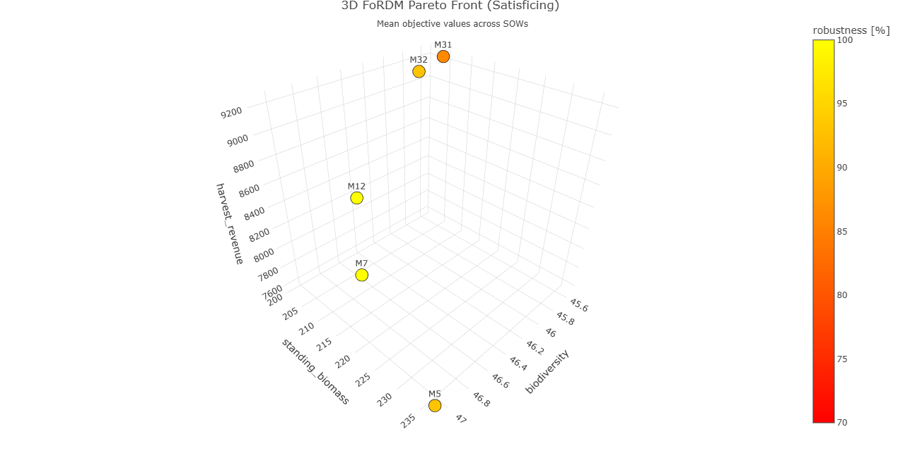
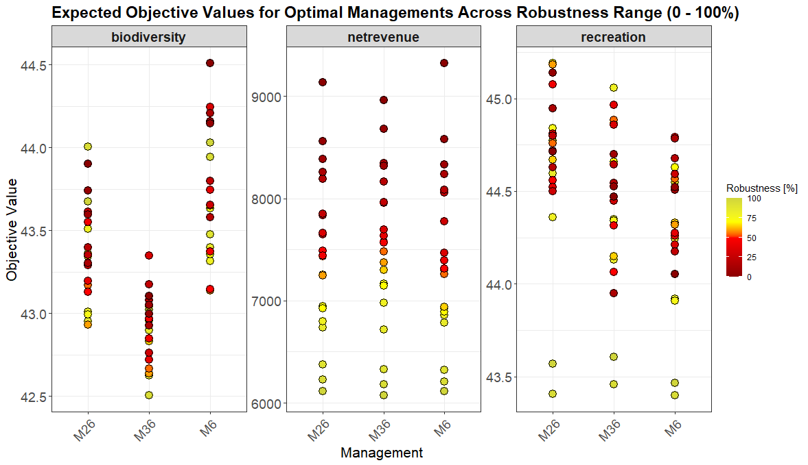

# FoRDM


**Fo**rest related Many-Objective **R**obust **D**ecision **M**aking (**FoRDM**) is an R-based toolkit for supporting robust forest management under deep uncertainty. Forests are facing unprecedented changes from global warming and disturbances, together with often conflicting management objectives, making decision-making under uncertainty challenging. FoRDM takes input from modelling to evaluate alternative management strategies across multiple objectives and plausible futures, identifying robust solutions and visualizing trade-offs through Pareto and robustness fronts. The toolkit includes regret-based and satisficing-based robustness analysis, flexible objective weighting, and interactive visualization. The current release is available as an R package and as a simplified, easy-to-use web application available [here](https://marcdjahangard.shinyapps.io/fordm_app/).

##
1. [Introduction](#introduction)  
2. [Structure](#structure)
3. [Input file](#input-file)  
4. [Functions](#functions)  
   - [build_fordm_table](#build_fordm_table)
   - [build_objectives_regret](#build_objectives_regret)
   - [build_objectives_satisficing](#build_objectives_satisficing)
   - [fordm_analysis_regret](#fordm_analysis_regret)
   - [fordm_analysis_satisficing](#fordm_analysis_satisficing)
   - [visualize_fordm_2d](#visualize_fordm_2d)
   - [visualize_fordm_3d](#visualize_fordm_3d)
   - [visualize_fordm_parcoord](#visualize_fordm_parcoord)
   - [visualize_fordm_parcoord_management](#visualize_fordm_parcoord)
   - [robustness_tradeoff_analysis](#robustness_tradeoff_analysis)
5. [Example](#example)  
6. [Citation](#citation)  
7. [Funding](#funding)  
8. [References](#references)

---

## Introduction
Ecosystems, especially forests, are increasingly threatened by climate change, making adaptive management essential to secure the multitude of provided ecosystem services in the future.
...

## Structure
Main implementation is an R package. This package provides helpers to build input tables and objectives, run robustness analyses (regret-based and satisficing-based), and visualize results (2D/3D Pareto fronts) as well as robustness frontier exploration.



## Input file
The input file (.csv) should contain output from a forest simulation model, with values for ecosystem services or other objectives. The file must contain columns for management, state-of-the-world (SOW), time, and one or more objectives.

Example column structure:
| management | sow | time | objective1 | objective2 | ... |
|------------|-----|------|------------|------------|-----|

## Functions

### **build_fordm_table()**
Transforms a given input file (`data.frame`) into the required FoRDM input format. Identifies columns for management, SOW (state-of-world), and time, treating all other columns as objectives.

**Inputs**
- `data`: `data.frame` containing the input data.  
- `management`: name of the management column in the input data.  
- `sow`: name of the SOW (state-of-world) column in the input data.  
- `time`: name of the time column in the input data.

**Output**
- A list containing the formatted table for analysis.
---
### **build_objectives_regret()**
Creates an objectives `data.frame` for regret-based analysis, defining names, optimization directions, weights, time aggregation methods, and discount rates for each objective.

**Inputs**
- `names`: character vector of objective column names.  
- `direction`: character vector specifying "maximize" or "minimize" for each objective.  
- `weights`: numeric vector of relative weights (must sum to 1).  
- `time_aggregation`: character vector specifying time aggregation methods ("mean", "sum", "max", "min").  
- `discount_rate`: numeric vector representing discount rates for each objective (e.g., 0.02 for 2%).

**Output**
- A `data.frame` with columns: `names`, `direction`, `weights`, `time_aggregation`, `discount_rate`.
---
### **build_objectives_satisficing()**
Creates an objectives `data.frame` for satisficing-based analysis, defining names, time aggregation, discount rates, thresholds, and directions for each objective.

**Inputs**
- `names`: character vector of objective column names.  
- `time_aggregation`: character vector specifying time aggregation methods.  
- `discount_rate`: numeric vector representing discount rates.  
- `treshold`: numeric vector of thresholds for each objective.  
- `direction`: character vector specifying "above" or "below" for each objective.

**Output**
- A `data.frame` with columns: `names`, `time_aggregation`, `discount_rate`, `treshold`, `direction`.
---
### **fordm_analysis_regret()**
Conducts a regret-based robustness analysis. Aggregates objectives across time (with discounting), computes regrets for each SOW and management, and selects robust representative SOWs. Produces Pareto fronts and identifies the optimal robust management.

**Inputs**
- `fordm_table`: output from `build_fordm_table()`.  
- `objectives`: output from `build_objectives_regret()`.  
- `robustness`: numeric value (0-1) specifying the robustness level.  
- `method`: method for regret calculation (e.g., "CVaR").

**Output**
- A list containing the optimal management and Pareto front.
---
### **fordm_analysis_satisficing()**
Performs a satisficing-based robustness analysis. Aggregates objectives, applies thresholds, and computes scores to identify the optimal management. Returns Pareto fronts.

**Inputs**
- `fordm_table`: output from `build_fordm_table()`.  
- `objectives`: output from `build_objectives_satisficing()`.  
- `robustness`: numeric value (0-1) specifying the robustness level.

**Output**
- A list containing the optimal management and Pareto front.
---
### **visualize_fordm_2d()**
Generates a 2D scatter plot of the Pareto front for two selected objectives using `ggplot2`. Supports regret and satisficing methods.

**Inputs**
- `analysis_output`: result from `fordm_analysis_regret()` or `fordm_analysis_satisficing()`.  
- `x`: name of the objective for the x-axis.  
- `y`: name of the objective for the y-axis.  
- `fordm_method`: "regret" or "satisficing".

**Output**
- A `ggplot2` plot visualizing the 2D Pareto front with management labels.

---
### **visualize_fordm_3d()**
Creates an interactive 3D Pareto front plot using `plotly` for three selected objectives. Supports regret and satisficing methods.

**Inputs**
- `analysis_output`: result from `fordm_analysis_regret()` or `fordm_analysis_satisficing()`.  
- `x`, `y`, `z`: names of the objectives for the three axes.  
- `fordm_method`: "regret" or "satisficing".

**Output**
- A `plotly` plot (interactive 3D scatter plot) visualizing the Pareto front.

---
### **visualize_fordm_parcoord()**
Creates an parallel coordinates plot of the Pareto front across all objectives using `plotly`. For regret-based analysis, shows objective values with uniform coloring. For satisficing-based analysis, includes robustness as an additional dimension with gradient color coding.

**Inputs**
- `analysis_output`: result from `fordm_analysis_regret()` or `fordm_analysis_satisficing()`.  
- `fordm_method`: "regret" or "satisficing".

**Output**
- A `plotly` parallel coordinates plot visualizing the Pareto front across all objectives. In satisficing mode, lines are colored by robustness percentage.
---
### **visualize_fordm_parcoord_management()**
Creates an parallel coordinates plot showing SOW (State-of-the-World) performance across objectives for a selected management strategy using `plotly`. For regret-based analysis, lines are colored by robustness percentile (0-100%). For satisficing-based analysis, lines are colored binary (red = not satisfied, green = all thresholds satisfied).

**Inputs**
- `fordm_table`: output from `build_fordm_table()`.  
- `objectives`: output from `build_objectives_regret()` or `build_objectives_satisficing()`.  
- `fordm_method`: "regret" or "satisficing".  
- `management`: character string specifying which management strategy to visualize.

**Output**
- A `plotly` parallel coordinates plot showing how the selected management performs across different SOWs, with each line representing one SOW scenario.
---
### **robustness_tradeoff_analysis()**
Explores trade-offs when relaxing robustness for better perfomance in regret-based FoRDM analysis. Sweeps robustness levels (0-100%), selects the optimal management at each level, tracks switches in optimal manageemnt, and summarizes marginal benefits/losses per objective.

**Inputs**
- `fordm_table`: output from `build_fordm_table()`.  
- `objectives`: output from `build_objectives_regret()`.  

**Output**
- A `list` with:
   - `summary`: list of data.frames. First entry gives the initial optimal management and its robustness range; subsequent entries correspond to switches and include `robustness_range`, `optimal_management`, and per-objective benefit/loss stats (`<prev_mgmt>_<objective>_benefit_min/mean/max`, `<prev_mgmt>_<objective>_loss_min/mean/max`).
   - `plot`: a ggplot2 scatter showing objective values for optimal managements across robustness levels.

---
## Example

```r
# Load package
library(FoRDM)

# Load your data (replace with your path)
df <- read.csv("YOUR_DATA.csv")

# Build FoRDM table (columns in your data must match)
fordm_table <- build_fordm_table(df, management = "management", sow = "scenario", time = "year")

# Regret-based objectives
objectives_regret <- build_objectives_regret(
  names = c("standing_biomass", "biodiversity", "harvest_revenue"),
  direction = c("maximize", "maximize", "maximize"),
  weights = c(0.2, 0.2, 0.6),
  time_aggregation = c("mean", "mean", "sum"),
  discount_rate = c(0, 0, 0.02))

# Regret-based analysis
output_fordm_regret <- fordm_analysis_regret(
  fordm_table = fordm_table,
  objectives = objectives_regret,
  robustness = 0.9,
  method = "CVaR")
output_fordm_regret$optimal
output_fordm_regret$pareto_front
# Visualize
visualize_fordm_2d(output_fordm_regret, x = "biodiversity", y = "harvest_revenue", fordm_method = "regret")
visualize_fordm_3d(output_fordm_regret, x = "biodiversity", y = "standing_biomass", z = "harvest_revenue", fordm_method = "regret")

# Satisficing-based objectives
objectives_satisficing <- build_objectives_satisficing(
  names = c("standing_biomass", "biodiversity", "harvest_revenue"),
  time_aggregation = c("mean", "mean", "sum"),
  discount_rate = c(0, 0, 0.02),
  treshold = c(100, 45, 6000),
  direction = c("above", "above", "above"))

# Satisficing-based analysis
output_fordm_satisficing <- fordm_analysis_satisficing(
  fordm_table = fordm_table,
  objectives = objectives_satisficing,
  robustness = 0.8)
output_fordm_satisficing$optimal
output_fordm_satisficing$pareto_front
# Visualize
visualize_fordm_2d(output_fordm_satisficing, x = "biodiversity", y = "harvest_revenue", fordm_method = "satisficing")
visualize_fordm_3d(output_fordm_satisficing, x = "biodiversity", y = "standing_biomass", z = "harvest_revenue", fordm_method = "satisficing")

# Robustness Frontier Exploration
output_rta <- robustness_tradeoff_analysis(fordm_table = fordm_table,
                                           objectives = objectives_regret)
output_rta$summary
output_rta$plot
```
---
## Citation
Djahangard & Yousefpour 2025

## Funding
This work was funded by the EU HORIZON project "eco2adapt" (grant number 101059498).

## Acknowledgment
...

## References
...
...existing code...
